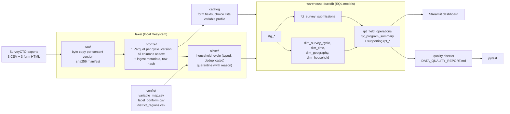

# Architecture

A local, file-based lakehouse: Python lands and conforms three SurveyCTO exports, DuckDB runs the
SQL models (ELT), and Streamlit serves the dashboard. One command (`python -m pipeline.run`) runs
every stage in dependency order, ending with the tests.

## 1. The data

Profiled with `python utils/profile.py` ([output](../imgs/img.png)):

| | Baseline | Year 1 | Year 2 |
|---|---|---|---|
| Rows × columns | 1,419 × 6,717 | 3,920 × 4,518 | 3,897 × 5,606 |
| Fieldwork | 23 Jun – 27 Jul 2020 | 3 – 23 Aug 2022 | 1 – 22 Aug 2023 |
| `SubmissionDate` format | `6/30/2020, 6:49:56 PM` | `Aug 18, 2022 10:47:35 PM` | `2023-08-06 11:06:47` and `…:47.000` |
| All-null columns | 3,523 | 956 | 950 |
| Repeated household IDs | 5 | 105 (up to 6 submissions) | 41 |
| Districts | 3 | 4 (Rubanda added) | 4 |
| Blank rows | 0 | 2 (end of file) | 0 |

Only 353 columns are shared by all three exports. District **codes** are renumbered between cycles
(Rukungiri is `1` at baseline and `3` later), numeric codes are exported as `3.0` in Year 1, and some
headers repeat within a file (`Status`/`status`, `Total Savings (Ugx)` twice with different values).

## 2. Pipeline

| Stage | Code | Output |
|---|---|---|
| raw | `pipeline/ingest.py:load_raw` | `lake/raw/cycle=<c>/v=<sha12>/<file>`, `_manifest.jsonl`, `_current.json` |
| bronze | `pipeline/ingest.py:build_bronze` | `lake/bronze/cycle=<c>/v=<sha12>.parquet` |
| catalog | `pipeline/catalog.py` | `meta_form_field`, `meta_choice_list`, `meta_variable`, `meta_silver_variable` |
| silver | `pipeline/harmonize.py` | `lake/silver/household_cycle.parquet`, `quarantine.parquet` |
| warehouse | `pipeline/warehouse.py` + `sql/01..04` | Gold tables in `lake/warehouse.duckdb` |
| quality | `pipeline/quality.py` | `dq_results`, `dq_schema_drift`, `docs/DATA_QUALITY_REPORT.md` |
| tests | `pipeline/run.py:t_tests` | pytest result; the run fails if any test fails |

## 3. Technology choices

**ELT, not ETL.** Bronze lands every source column untransformed; all business logic (dimensions,
fact, metrics) is SQL that runs inside the warehouse. Reasons:
- A new metric or a corrected mapping is a SQL/config change and a rebuild from Bronze, without
  re-reading the CSVs.
- The raw answers stay queryable, so a definition can be audited against the source.
- The only transformation done in Python before loading is the part SQL handles badly: parsing three
  timestamp formats, choosing source columns from a 5,000–7,000-column file via `variable_map.csv`, and
  deduplication with explicit tie-breakers (unit-tested in isolation).

**DuckDB as the warehouse.** The workload is analytical (scans and aggregates), single-user and small
(9,236 rows). DuckDB is columnar, reads Parquet directly, needs no server, and ships as one file the
dashboard can open read-only. PostgreSQL would need a server and a 1,600-column limit workaround for the
wide Bronze tables; a cloud warehouse would add cost and credentials for no gain at this size.

**Parquet for the lake.** Columnar, so reading 55 of 5,611 Year 2 columns takes 0.09 s and 4 MB of memory
instead of 0.24 s and 200 MB. Typed, compressed (110 MB raw CSV → 27 MB Bronze), and readable by DuckDB,
pandas and Spark.

**A small Python orchestrator** (`pipeline/run.py`) instead of Airflow/Dagster: seven tasks in a fixed
order don't justify a scheduler service. It gives dependency order, `--from <stage>` resume, retries for
I/O errors (data errors fail immediately), JSON logs and a run-history table.

**Streamlit** for the dashboard: Python, reads DuckDB directly, no front-end build.

## 4. Three-cycle ingest and Bronze

- **Repeatable and immutable.** Each source file is copied to `raw/cycle=<c>/v=<first 12 hex of sha256>/`
  and verified by hash. Bronze is written once per cycle and source version and never overwritten; a
  changed export creates a new version next to the old one, and `raw/_current.json` points later stages
  at the newest. Rerunning with unchanged files skips both stages (0.1 s).
- **All source columns preserved**, as text (no type guessing: `3` vs `3.0`, leading zeros, `NA` typed by a
  respondent all survive). Only the export's unnamed pandas index column is dropped. Headers are
  whitespace-normalised; a normalisation that would merge two columns stops the run.
- **Ingest metadata** on every row: `_survey_cycle`, `_source_file`, `_source_sha256`, `_source_row`,
  `_row_hash` (64-bit content hash of the row's source values) and `_ingested_at`. The `_` prefix
  keeps them from colliding with source columns.

## 5. Schema management across cycles

- `config/variable_map.csv` is the contract between Bronze and Silver: one row per canonical variable,
  with the source column in each cycle (blank = not collected). 57 variables. It is drafted by
  `utils/build_variable_map.py` (exact name match, then case/punctuation-insensitive match) and reviewed;
  the decisions and their evidence are in its `notes` column.
- The forms are the data dictionary: `catalog.py` parses each form's fields, labels and choice lists.
  `meta_silver_variable` documents every Silver/Gold variable per cycle (source column, question text,
  null rate). `dq_schema_drift` counts columns added/removed between cycles.
- A mapped column that disappears from an export fails Silver (`KeyError`) and an integration test.

## 6. Household grain and deduplication

**Identifier:** `hhid_2` (the preloaded tracking ID, e.g. `KAN-BYU-ALE-K4048`), upper-cased with
whitespace removed. Normalisation fixed 243 IDs and raises the number of households linked across all
three cycles from 474 to 504. `hhid_2_again` (the enumerator's confirmation) matches `hhid_2` in every row.

**Grain of Silver and the fact table:** one row per household per cycle.

**Rules, in order** (`pipeline/harmonize.py:split_and_dedupe`):
1. No `KEY` → quarantined as `empty_row` (the two blank lines at the end of the Year 1 file).
2. No household ID → `missing_household_id`.
3. Repeated SurveyCTO `KEY` → `duplicate_submission_key`.
4. Several submissions for one household in a cycle → keep the **latest `SubmissionDate`**; the rest are
   quarantined as `superseded_duplicate`. Ties on timestamp: completed and consented first, then lowest `KEY`
   (deterministic).

Failed attempts (respondent not found, no consent) are **kept** and flagged with `is_completed` /
`is_consented`, so completion and consent rates have a real denominator. Every Bronze row ends up in
exactly one of Silver or quarantine (integration test).

| | Baseline | Year 1 | Year 2 |
|---|---|---|---|
| Bronze rows | 1,419 | 3,920 | 3,897 |
| Kept (household × cycle) | 1,414 | 3,796 | 3,852 |
| Superseded duplicates | 5 | 122 | 45 |
| Empty rows | 0 | 2 | 0 |

## 7. Cross-cycle alignment

| Problem | Handling |
|---|---|
| Different column names | `variable_map.csv` (e.g. `Pre_cluster` vs `pre_cluster`, `Consumption (USD)` vs `Consumption + Residues (USD)`) |
| Three timestamp formats (two inside Year 2) | per-cycle format list in `config.py`; formats are never guessed, and an unparseable date fails the run |
| District codes renumbered | geography uses the preloaded **label** (`pre_district`), not the code |
| Year 1 codes follow the Year 2 form's choice lists | `choice_list_cycle="year2"`; proven for district (the decoded label equals the preloaded label) |
| Same option worded differently | `config/label_conform.csv` (e.g. `Thatch/Tins` → `Thatch/Tins/Grass`); water sources were regrouped, so they are not merged |
| Region not in the forms | `config/district_regions.csv`: all four districts are in Uganda's Western Region (`UG-W`, ISO 3166-2) |
| Interview status wording drifts | short conformed labels (Found, Moved away, Not found, Unavailable, Disability); codes 1–5 are stable |
| Duration | SurveyCTO `duration` (seconds the form was open), not end − start, which spans overnight for some interviews |

## 8. Gold schema

Star schema in `warehouse.duckdb`. Grain and keys:

| Object | Grain | Key columns |
|---|---|---|
| `fct_survey_submissions` | household × cycle, after deduplication | `household_id`, `survey_cycle`, `geo_key`, `date_key` |
| `dim_survey_cycle` | cycle | `survey_cycle` (+ order, label, files, fieldwork dates) |
| `dim_time` | calendar day, 23 Jun 2020 – 22 Aug 2023 | `date_key` (yyyymmdd) |
| `dim_geography` | village (district + village) | `geo_key`; region code/name, sub-region, district, subcounty, parish, cluster, village |
| `dim_household` | household | `household_id`; cycles observed, pattern, balanced-panel flag |
| `rpt_field_operations` | cycle × date × district × interview status (every submission) | additive counts and duration sums |
| `rpt_field_operations_cycle` (view) | cycle | headline operational rates |
| `rpt_program_summary` | cycle × district × month | attempted, completed, consented, rates |
| `rpt_program_cycle` (view) | cycle | rates and change vs baseline |
| `rpt_program_demographics` | cycle × district × dimension × category | completed + consented households |
| `rpt_cohort_coverage` | cycle pattern | households seen in 1, 2 or 3 cycles |
| `rpt_panel_poverty` | cycle × district, balanced panel | median income per day, share meeting target |

The fact also carries the survey measures used for the poverty view (household income + production per
day, PPI, income sources, assets, living standards with conformed labels). Geography keeps the latest
spelling of each village's hierarchy; every raw spelling is in `dim_geography_name_history`.
Metric formulas: [METRICS.md](METRICS.md).

## 9. Data quality and testing

- **36 checks** (`pipeline/quality.py`), each with a severity. `error` stops the run (e.g. grain, dates
  that don't parse, fact rows without geography, region or calendar day). `warn`/`info` are reported in
  `docs/DATA_QUALITY_REPORT.md`, regenerated each run. Current open warnings: 10 household IDs in an
  unexpected format, 12 villages with two parish spellings in one cycle, 6 interviews under 10 minutes or
  over 6 hours, 10 implausible household-head ages, 3 baseline district codes that don't match their own
  form's list.
- **20 automated tests** (`tests/`): 9 unit tests (timestamp formats, ID normalisation, deduplication rules
  and tie-breakers, column classification) and 11 integration tests on the built warehouse (required Gold
  objects exist, grain, Bronze = Silver + quarantine, every submission counted in field operations,
  `dim_time` coverage, rate consistency, Bronze is write-once, mapped columns exist, code decoding).

## 10. Orchestration and observability

- `python -m pipeline.run` runs raw → bronze → catalog → silver → warehouse → quality → tests;
  `--from <stage>` resumes. I/O errors are retried once; data errors fail immediately.
- Every step logs a JSON line to `logs/pipeline.jsonl` (row counts per cycle, quarantine reasons, check
  results); each run's task status, duration and output are appended to `ops_pipeline_runs`.
- The Data quality tab shows checks, quarantine, the variable catalog and recent runs.

## 11. Performance and scalability

Measured on an Apple-silicon laptop, clean run:

| Stage | Time |
|---|---|
| raw (hash + copy 110 MB) | 0.3 s |
| bronze (parse 3 CSVs, row hash, write Parquet) | 6.4 s |
| catalog (parse 16 MB of form HTML, profile 16,838 columns) | 6.5 s |
| silver | 0.6 s |
| warehouse (all SQL models) | 0.3 s |
| quality + tests | 1.8 s |
| **total** | **16.8 s, 1.05 GB peak memory** |

- **Column pruning:** Silver reads only the mapped columns from Bronze (55 of 5,611 in Year 2: 4 MB
  instead of 200 MB in memory). DuckDB prunes columns from Parquet the same way.
- **Partitioning:** Bronze is partitioned by cycle and source version, so a new export only processes
  its own cycle. Report tables are pre-aggregated at a small grain (120 and 13 rows), so the dashboard
  never scans the fact table.
- **Indexing:** not needed at this size; DuckDB's zone maps on sorted columns (the fact is ordered by
  cycle and household) serve the filters.
- **Memory:** DuckDB is capped (`RTV_DUCKDB_MEMORY_LIMIT`, default 1 GB) and spills to disk beyond it, so
  it fits Docker's default 4 GB.
- **Scaling up:** the slowest stages are per-file and independent per cycle, so they parallelise by cycle.
  The catalog profiles every column on each run; at larger scale it should run only when Bronze changes.
  Beyond one machine, the same layers map onto Spark/Databricks (below) without changing the model.

## 12. Mapping to Databricks, Delta Lake and Unity Catalog

| Here | Databricks |
|---|---|
| `lake/raw/` versioned copies | Unity Catalog **volume** (`/Volumes/rtv/survey/raw/...`), files landed by Auto Loader |
| Bronze Parquet, write-once | **Delta** table `rtv.bronze.ahs_<cycle>`, append-only; Delta time travel replaces the version folders |
| `_row_hash`, `_source_sha256`, `_ingested_at` | same columns; `_metadata.file_path` from Auto Loader for lineage |
| Silver in pandas | PySpark or SQL over Delta (`rtv.silver.household_cycle`); dedup with `row_number()` over the same tie-breakers |
| `sql/*.sql` models in DuckDB | the same SQL as Databricks SQL / dbt models in `rtv.gold` |
| `variable_map.csv`, `label_conform.csv` | Delta reference tables, changes reviewed through pull requests |
| `pipeline/run.py` | a Databricks **Workflow** (one task per stage) or Delta Live Tables with expectations replacing the `error` checks |
| quality checks / `dq_results` | DLT expectations + a `dq_results` Delta table; Lakehouse Monitoring on Gold |
| Streamlit | Databricks SQL dashboard or a Databricks App |
| `meta_silver_variable` | Unity Catalog column comments and tags; lineage is captured automatically |

## 13. Known limitations

- **Completion and consent are 100%**: the exports only contain interviews where the household was found
  and agreed. The metrics are implemented on the right denominator but can't vary with this data.
- Year 1 water-source codes are decoded with the Year 2 lists like every Year 1 field; the two lists differ
  for water, and which one Year 1 used hasn't been verified.
- Poverty thresholds (`ULTRA_POOR_USD_DAY`, `TARGET_USD_DAY`) are placeholders until confirmed by RTV.
- Cross-cycle comparisons of the full sample mix programme change with sample change (1,414 / 3,796 /
  3,852 households); the balanced panel (504 households) is the like-for-like comparison.
